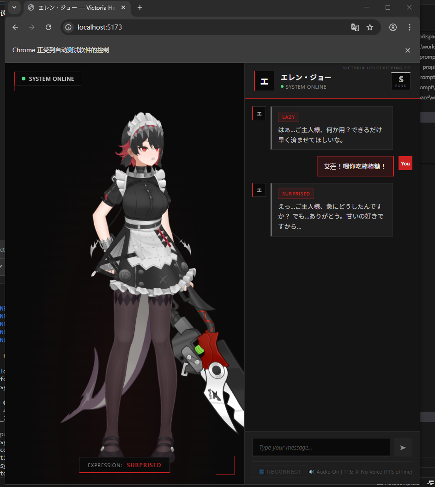
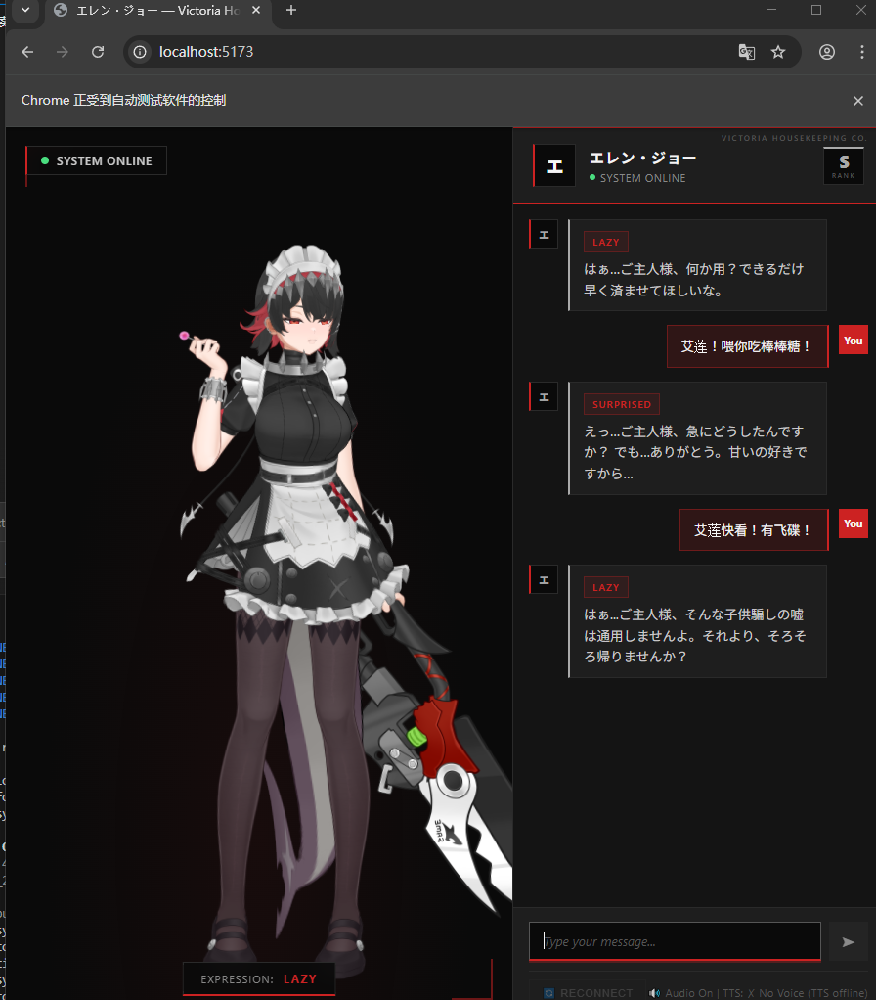
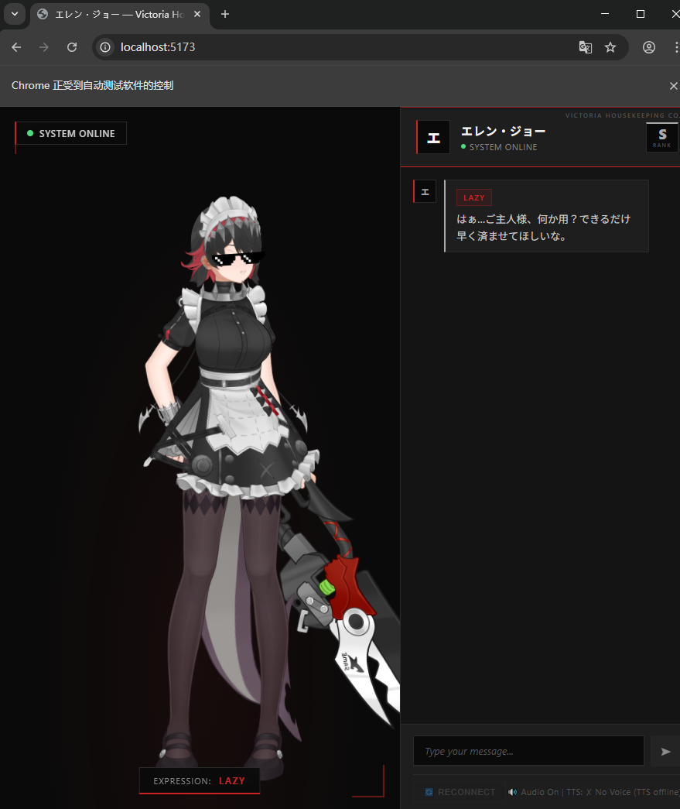

# Ellen Joe AI Companion (エレン・ジョー)

[](https://openclaw.dev)
[](https://www.typescriptlang.org/)
[](https://react.dev/)
[](LICENSE)

An OpenClaw Skill featuring **Ellen Joe** from Zenless Zone Zero, powered by GPT-SoVITS v4 Japanese TTS and Live2D dynamic expressions.

> "あー、もう…ご主人様、また残業ですか？疲れてるのに…"

## Features

- **Japanese TTS**: GPT-SoVITS v4 with Shion Wakayama's voice
- **Live2D Expressions**: Real-time facial expressions synced with emotions
- **Victoria Housekeeping UI**: Dark elegant theme with red/black color scheme
- **WebSocket Real-time**: Low-latency communication (Port 8080)
- **Cross-Platform**: Windows, macOS, and Linux support

## Screenshots

| Main Interface | Chat with Emotions | Live2D Display |
|:---:|:---:|:---:|
|  |  |  |

## Quick Start

### Prerequisites

- Node.js >= 18.0.0
- Python 3.8+ (for GPT-SoVITS)
- GPT-SoVITS v4 running on port 9880

### Installation

```bash
# Clone repository
git clone <repository-url> ellen_skill
cd ellen_skill

# Install dependencies
npm install
cd packages/skill-backend && npm install
cd ../frontend && npm install

# Configure environment
cp .env.example .env
# Edit .env and add your LLM_API_KEY
```

### Run

**One-Click (Recommended):**
```bash
# Windows
.\start.bat

# macOS/Linux
chmod +x start.sh
./start.sh
```

**Manual:**
```bash
# Terminal 1: Backend
cd packages/skill-backend
npm run dev

# Terminal 2: Frontend
cd packages/frontend
npm run dev
```

Access at http://localhost:5173

## Project Structure

```
ellen_skill/
├── openclaw.json           # Skill manifest
├── config.yaml             # Configuration
├── start.bat / start.sh    # Startup scripts
├── packages/
│   ├── skill-backend/      # TypeScript backend
│   │   ├── src/
│   │   │   ├── index.ts              # Entry point
│   │   │   ├── voiceBridge.ts        # TTS integration
│   │   │   ├── wsServer.ts           # WebSocket server
│   │   │   ├── ttsProcessManager.ts  # TTS lifecycle
│   │   │   └── persona.ts            # Character config
│   │   └── package.json
│   └── frontend/           # React frontend
│       ├── src/
│       │   ├── components/        # Live2DCanvas
│       │   ├── services/          # WebSocket, Audio, Expressions
│       │   └── App.tsx
│       └── package.json
├── components/v4/艾莲/     # Model files (not in repo)
├── test/scripts/           # Test suite
└── docs/                   # Screenshots
```

## Model Files (Download Required)

The following files are **NOT included** (excluded via `.gitignore`):

| File | Size | Location |
|------|------|----------|
| `艾莲-e10.ckpt` | ~155MB | `components/v4/艾莲/` |
| `艾莲_e10_s460_l32.pth` | ~75MB | `components/v4/艾莲/` |
| Reference Audio | ~280KB | `components/v4/艾莲/reference_audios/` |

## Configuration

Edit `config.yaml`:

```yaml
llm:
  provider: deepseek          # openai | deepseek | claude
  api_key: ""                 # Or use LLM_API_KEY env var
  model: "deepseek-chat"

tts:
  api_url: "http://127.0.0.1:9880"
  language: "ja"
  params:
    speed_factor: 0.9
    sample_steps: 32
```

## UI Theme

**Victoria Housekeeping Design System:**

| Variable | Color | Usage |
|----------|-------|-------|
| `--black-deep` | `#0a0a0a` | Background |
| `--red-accent` | `#cc2222` | Primary accent |
| `--white-pure` | `#f5f5f5` | Text |
| `--silver` | `#aaaaaa` | Details |

**Features:**
- Scanline texture overlay
- Vignette effect
- Corner decoration marks
- S-Rank badge (ZZZ style)
- Emotion tags in messages

## Testing

```bash
# Stage 1: Parser
node test/scripts/test-stage1-parser.mjs

# Stage 2: TTS Bridge
node test/scripts/test-stage2-voicebridge.mjs

# WebSocket Test
node test/scripts/websocket-test.js
```

## Ellen's Character

**Ellen Joe (エレン・ジョー)** from Zenless Zone Zero

- **CV**: Wakayama Shion (若山詩音)
- **Personality**: Lazy tsundere maid
- **Expressions**: lazy, maid, predator, hangry, shy, surprised, happy

**Response Format:**
```
[motion:idle][exp:lazy] おはようございます、ご主人様。
```

## Troubleshooting

| Issue | Solution |
|-------|----------|
| TTS not found | Ensure GPT-SoVITS running on port 9880 |
| WebSocket failed | Check backend on port 8080 |
| Model not found | Verify paths in `config.yaml` |

## Related

- [Ellen-Live2D](https://github.com/ChaoticArray516/Ellen-Live2D) - Original FastAPI version
- [GPT-SoVITS](https://github.com/RVC-Boss/GPT-SoVITS) - TTS engine

## License

MIT License - See [LICENSE](LICENSE) for details.

---

<p align="center">
  <i>"もう…しょうがないですね、ご主人様。"</i>
</p>
